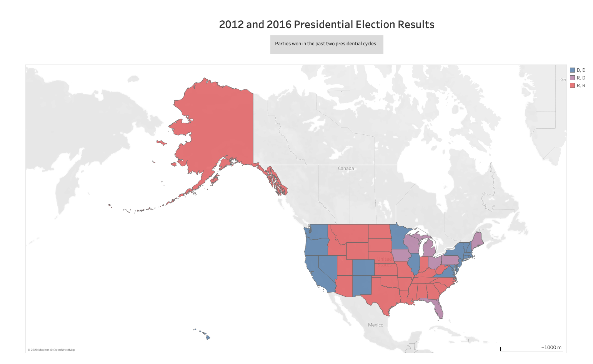
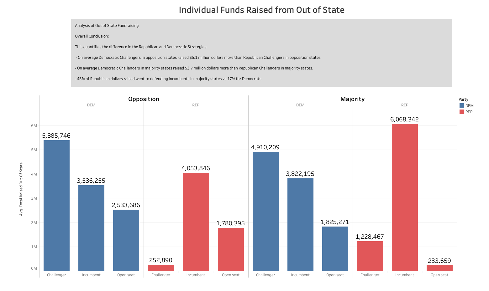
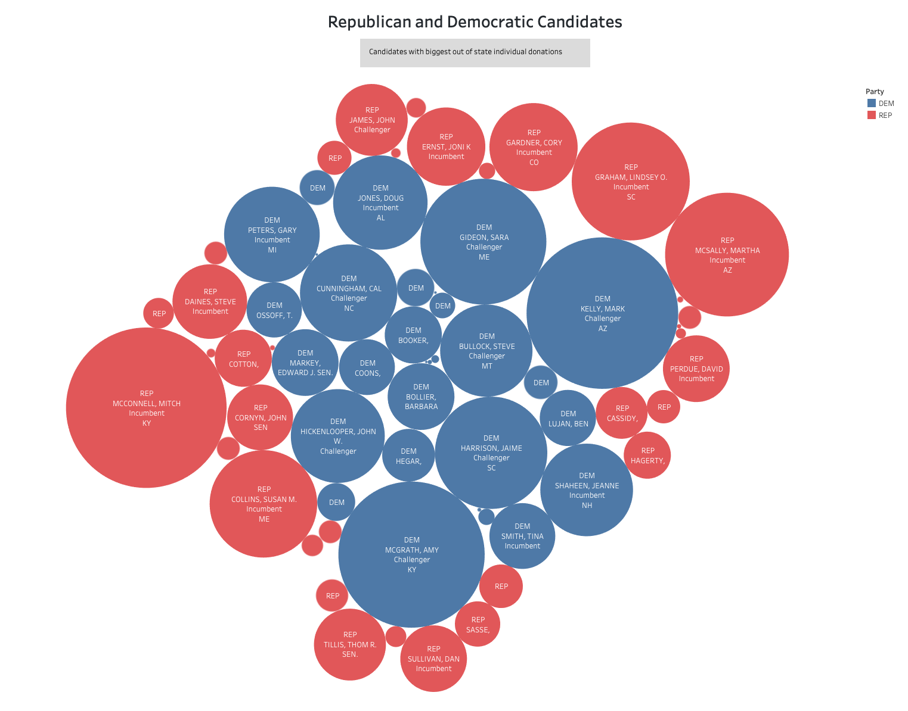

# Group: 1-blue-json-mraz Project 1

# Topic: Individual Campaign Fundraising

## Team Members
* Felipe Lopez 
* Carlos Pires 
* Michelle Nguyen 
* Karen Kitchens 
* Reid Haynie  

## Background: Individual Campaign Fundraising for Senate Candidates 

Candidates running for federal office in the United States must report all donations, and money that their campaign receives to the FEC (Federal Election Committee). This information is on public record and made available by that agency. The FEC.gov website allows you to do an extraordinary amount of research and comparison. It is easy to look up who raised the most money in 2020 from Super Pacs or Individual donors. The FEC provides their public information in many forms throughout their website (in bulk downloads, in-browser tools), but they also have a robust API,the OpenFec https://api.open.fec.gov/developers/. Where people can draw out the exact data that they are interested in. 

We were mostly curious about in-state versus out-of-state campaign donations. Why would someone who can't vote for a person donate to that person's campaign? Why woudl a Senator who has difficult raising money in the state of his own consitutents, yet major success from outsider contributions? Since that question is so braod and involves so many factors, we narrowed our question down to one easily answered question about the 2020 Senate race:

## Question 

What enables a Senate Candidate's ability to raise money from out of state?
Does a challenger raise more money out of state if they are a member of their states majority party or if they are a member of their states oppositions party? 

## Hypothesis

We think that having the best opportunity to gain a seat for either party will most encourage out-of-state of donations(so, Republican challengers in Republican states and Democratic Challengers in Democratic States.

Since they are the opposition of the party of their state, they would be less likely to raise money in-state, and that states with whom they share a party affiliation would donate heavily to that challenger, in an attempt to gain that seat.

## Data Sources

* A `config.py` file will be required for the notebook to run. This contains the FEC API Key. We are pulling donations from individual donors.
* FEC API 
    * Candidate information: "https://api.open.fec.gov/v1/candidates/"
    * Finance Data: "https://api.open.fec.gov/v1/schedules/schedule_a/by_state/by_candidate/"
* FEC CSV 
    * `2012.csv` & `2016.csv`
    *FEC Presedential election data for map of blue states and red states 
    
* Tableau:  https://public.tableau.com/profile/michelle.nguyen4439#!/vizhome/Project1-FINAL/Sheet4?publish=yes

* We started out with 2 separate CSV files that separated financial data by Democratic and Republicans then we ended up merging into one.

## Findings

Democratic Challengers regardless of their state's majority raised the best among Democrats and Republican incumbents in Republican majority states did the best among Republicans.

## Data Munging

We pulled a list of all 2020 senate candidates, which included candidate information such as state, party affiliation, and incumbency status. We also pulled a list of totals raised by every candidate that was broken down by state. After joining these lists on candidate ID, we totaled all of the candidate’s out-of-state donations and created columns for their in-state and out-of-state fundraising totals.

## Definitions

* Red state = Voted Republican last two presidential elections
* Blue state = Voted Democrat last two presidential elections
* Member of the opposition = Your party doesn’t align with the color of your state 
* Member of the majority = Your party aligns with the color of your state
* Individual Donors = non group funds

Figure 1:

Figure 2:

Figure 3:

## Conclusion

Democrats clearly have a strategy to go on the offense while Republicans are clearly trying to maintain the seats that they have.

## Future Research

We consider that this could be determined by who holds a majority in the senate. It would be interesting to analyze current House races to see if this would be inverted, considering Democrats hold a majority there. It would also be helpful to look at past Senate elections to see if our conclusions hold true.
