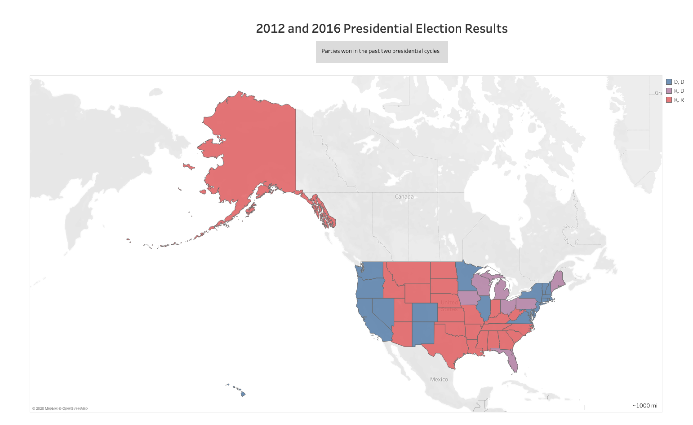
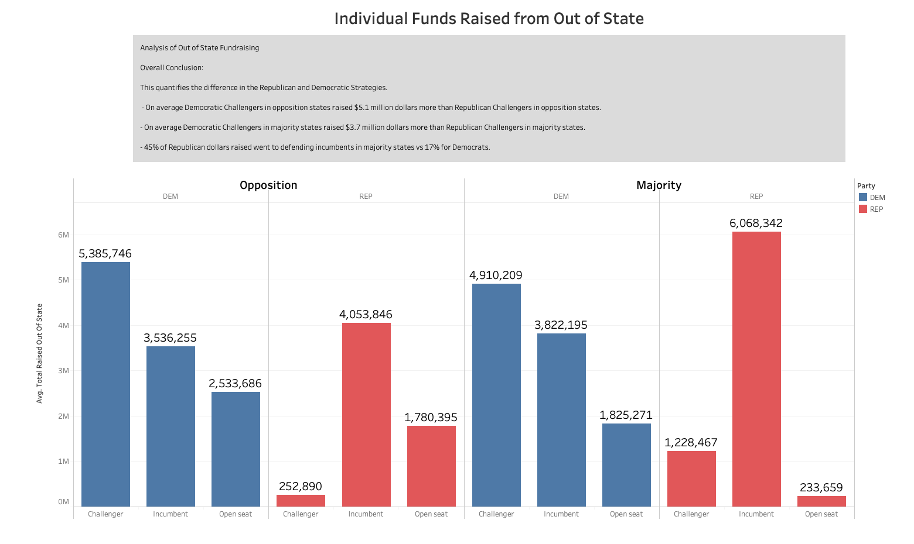
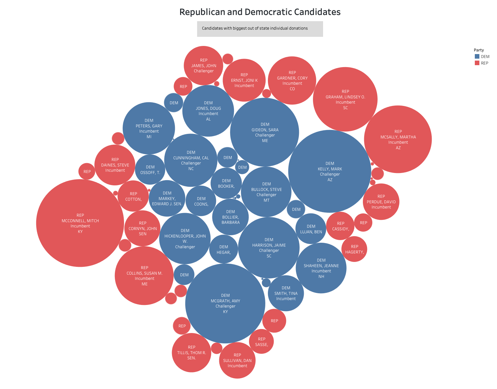

# Group: 1-blue-json-mraz Project 1

# Topic: Individual Campaign Fundraising

## Team Members
* Felipe Lopez 
* Carlos Pires 
* Michelle Nguyen 
* Karen Kitchens 
* Reid Haynie  

## Background: Individual Campaign Fundraising

Candidates running for federal office in the United States must report all donations, and money that their campaign receives to the FEC (Federal Election Committee). This information is on public record and made available by that agency. The FEC.gov website allows you to do an extraordinary amount of research and comparison. It is easy to look up who raised the most money in 2020 from Super Pacs or Individual donors. The FEC provides their public information in many forms throughout their website (in bulk downloads, in-browser tools), but they also have a robust API,the OpenFec https://api.open.fec.gov/developers/. Where people can draw out the exact data that they are interested in. 

We were mostly curious about in-state versus out-of-state campaign donations. Why would someone who can't vote for a person donate to that person's campaign? Why woudl a Senator who has difficult raising money in the state of his own consitutents, yet major success from outsider contributions? Since that question is so braod and involves so many factors, we narrowed our question down to one easily answered question about the 2020 Senate race:

## Hypothesis:

Our hypothesis, is that since they are the opposition of the party of their state, that they would be less likely to have the ability to raise money in-state, and that states with whom they share a party affiliation would donate heavily to that challenger, in an attempt to get control of the Senate.
We think that having the best opportunity to gain a seat for either party will most encourage out-of-state of donations(so, Republican challengers in Republican states and Democratic Challengers in Democratic States.

## Question: 

What enables a Senate Candidate's ability to raise money from out of state?
Does a challenger raise more money out of state if they are a member of their states majority party or if they are a member of their states oppositions party? 

## Findings:

Democratic Challengers regardless of their state's majority raised the best among Democrats and Republican incumbents in Republican majority states did the best among Republicans.

## Data Sources

* A `config.py` file will be required for the notebook to run. This contains the FEC API Key. We are pulling donations from individual donors.
* FEC API 
    * Canidate information: "https://api.open.fec.gov/v1/candidates/"
    * Finance Data: "https://api.open.fec.gov/v1/schedules/schedule_a/by_state/by_candidate/"
* FEC CSV 
    * `2012.csv` & `2016.csv`
    *FEC Presedential election data for map of blue states and red states 
    
* Tableau:  https://public.tableau.com/profile/michelle.nguyen4439#!/vizhome/Project1-FINAL/Sheet4?publish=yes

* We started out with 2 separate CSV files that seperated financial data by Democratic and Republicans then we ended up merging into one.

## Data Munging

{Reids info here}

## Definitions

* Red state = Voted Republican last two presidential elections
* Blue state = Voted Democrat last two presidential elections
* Member of the opposition = Your party doesn’t align with the color of your state 
* Member of the majority = Your party aligns with the color of your state
* Individual Donors = non group funds

Viz 1: 
A Bar Chart that identifies 
The Average raised out of state for
	a. A democrat Challenger Opposition
	b. A democrat Challenger Majority
	c. A democrat Challenger Swing
	d. A republican Challenger Opposition
	e. A republican Challenger Majority
	f. A republican Challenger Swing

Figure 1:
Explain the map

Figure 2:
Explain the graph

Figure 3:
Explain why we chose this graph

## CONCLUSIONS

Democrats clearly have a strategy to go on the offense while Republicans are clearly trying to maintain the seats that they have.

## FURTHER RESEARCH

