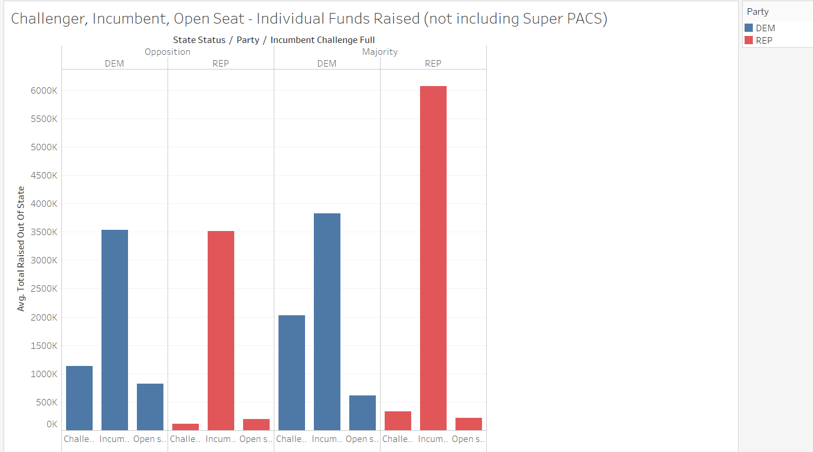
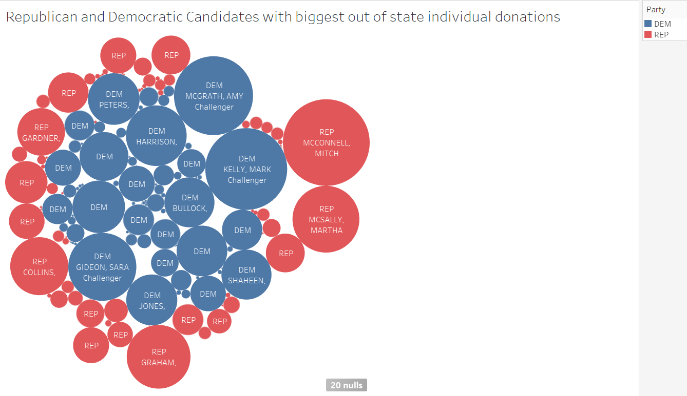

# Group: 1-blue-json-mraz Project 1

# Topic: Individual Campaign Fundraising

## Team Members
* Felipe Lopez 
* Carlos Pires 
* Michelle Nguyen 
* Karen Kitchens 
* Reid Haynie  

## Background: Individual Campaign Fundraising

This project aims to answer the questions ff these variables which one has the largest effect on your ability to raise money out of state, Incumbency, Partisanship, State, Election Cycle based on the resources below.

As a Congressional candidate what indicates the probability of you being able to pull in money from out of state. Creating a Candidate Demographic*- what kind of candidate is more likely to get money from out of state. 

## Hypothesis

Does a challenger raise more money out of state if they are a member of their states majority party or if they are a member of their states oppositions party? 

## Data Sources
* A `config.py` file will be required for the notebook to run. This contains the FEC API Key. We are pulling donations from individual donors.
* FEC API 
    * Canidate information: "https://api.open.fec.gov/v1/candidates/"
    * Finance Data: "https://api.open.fec.gov/v1/schedules/schedule_a/by_state/by_candidate/"
* FEC CSV 
    * `2012.csv` & `2016.csv`
    *FEC Presedential election data for map of blue states and red states 
    
* Tableau:  https://public.tableau.com/profile/michelle.nguyen4439#!/vizhome/Project1-FINAL/Sheet4?publish=yes

* We started out with 2 seperate CSV files that seperated financial data by Democratic and Republicans then we ended up merging into one.

## Data Munging

{Reids info here}

## Definitions

* Red state = Voted Republican last two presidential elections
* Blue state = Voted Democrat last two presidential elections
* Member of the opposition = Your party doesn’t align with the color of your state 
* Member of the majority = 
* Individual Donors = non group funds

## QUESTIONS and Analysis: 

Viz 1: 
A Bar Chart that identifies 
The Average raised out of state for
	a. A democrat Challenger Opposition
	b. A democrat Challenger Majority
	c. A democrat Challenger Swing
	d. A republican Challenger Opposition
	e. A republican Challenger Majority
	f. A republican Challenger Swing
Hypothesis : B and C will raise more money. 

* Which of the following variables has the most impact on your ability to raise money out of state:
* Is it your party? Is it your candidacy status? 
* Does a challenger raise more money out-of-state if they are a member of their state’s majority party or if they are a member of their state’s opposition party?
* Do they raise more if they are a part of the opposition or a part of the majority

# ? Do we want this Questions to think about
* Who were the top 3
* How much $$ was raised by Democrats based on individual donors by state?
* Total $ raised by state
* Who does better raising funds, incumbents or challenger?
* Which state raised more money?
* How much money this state donates to other states campaign?
* Which candidates received more donation from this state.

Visualizations - 
1st visualization - Which states have the most funding? Republicans & Democrats per state
2nd visualization - For that state with the most funds, split Republicans and Democrats (ex. California and Texas)
3rd visualization - How much money donated were from instate/outofstate/superpacs?
4th visualization - Top 2 Senate candidates (Republican + Democrat from each state) per state

